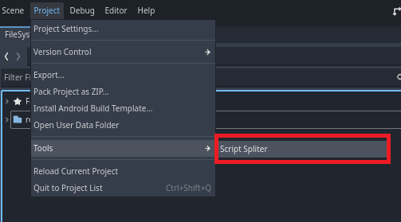
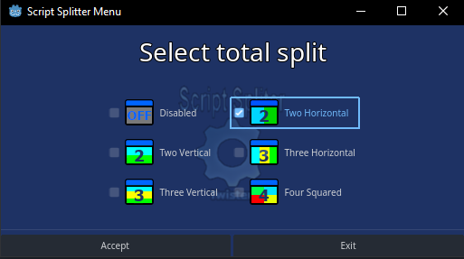
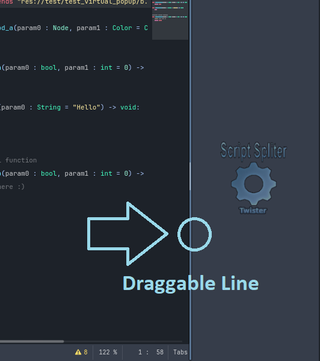

# Script-Spliter
Tool addon for Godot 4, this addon allow split the script editor window.

  

# Preview

### V0.2 Video Preview

### V0.1 Image Preview

# NEWS
### V0.2
The internal workflow has been modified, but the functionality of its predecessor version has been maintained.

This has been done to maintain compatibility when using shorteners like Ctrl + [1, 2, 3, 4] to change the split style, this might be broken in version 0.3, see the roadmap for details.

differences with version 0.1:
* It more closely resembles the default editor window.
* Reduces window switching time.
* Allows you to zoom in on all windows.
* You may have a separate script documentation help window.
* Some visual aspects and configurable parameters in Editor Settings.

# Features
* Split Window of Document Files Like Script/Document Helper Window.
* Split Two Window Horizontal/Vertical.
* Split Three Window Horizontal/Vertical.
* Split Four Window Squared.
* Split Custom Window defined by you.
* Plugins Setting in Editor Settings. *(In the section Plugin, you can see with advance option enabled!)*
* V0.2.2 Refresh Warnings changes on save in all opened windows (Errors/Warning Script) *(Experimental: This option can be disabled on Editor Settings)*

# ROADMAP
* Version > 0.2.x: Flying scripts; Allow split in separate windows.
* Version >= 0.3:
  * Change logo/colors: Currently the pet I use on github is placed and it is planned to change it to one more suitable for the plugin. 
  * Using tabs for drag and drop between windows. *(WARNING! : Some features offered in previous versions may change)*

# How Work
  
>[!TIP]
> Now you can add or remove split with using context menu, the popup menu appear using the RMB (Right mouse button) in the editor.
>
> * Use Add/Remove split if you want increase or decrease the auto split window function.

>[!WARNING]
> Keep in mind, the style when appear new window (As Column or Row) depend of you configuration split style!
>
> *This may change in future releases.*

### Enable by shortcut
* Press shortcut (**Ctrl + 1**) for set one window.
* Press shortcut (**Ctrl + 2**) for set one split of two windows: Horizontal.
* Press shortcut (**Ctrl + 3**) for set one split of two windows: Vertical.
* Press shortcut (**Ctrl + 4**) for set two split of three windows: Horizontal.
* Press shortcut (**Ctrl + 5**) for set two split of three windows: Vertical.
* Press shortcut (**Ctrl + 6**) for set three split of four windows: Squared split.

### Enable by Tool Menu
For enable the Script spliter menu go to **Project > Tools > Script Spliter**.

You can select split type and disabled, see the image.

Once activated, you'll see a draggable line like the one in the image, indicating that the plugin is active.

>[!IMPORTANT]
>This section will automatically expand when you open **two scripts**.

The position of the line will vary depending on the selection of horizontal or vertical.

Copyrights (c) CodeNameTwister. See [LICENSE.md](LICENSE.md) for details.

[godot engine]: https://godotengine.org/
